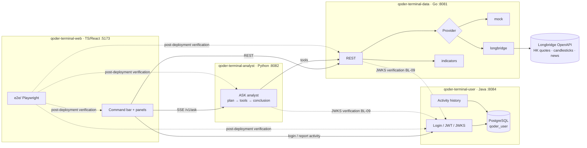

# Architecture

## Contract ownership

| Contract | Owner | Consumers |
|---|---|---|
| `qoder-terminal-data/api/openapi.yaml` | data | analyst, web |
| `qoder-terminal-analyst/api/openapi.yaml` + `agent-event.schema.json` | analyst | web |
| `qoder-terminal-user/api/openapi.yaml` + JWT claims | user | data, analyst, web |

**Whoever provides an API owns its contract.** Cross-repo requirements always merge the provider's contract change first, then consumers follow; web's `e2e/tests/contracts.api.spec.ts` verifies after deployment that the contracts are really honored.

## Design principles

| Principle | Implementation |
|---|---|
| No floating-point prices | Contracts use decimal strings; Go uses fixed-point `internal/money`; the frontend only displays |
| Demos never break | data defaults to `mock`, analyst defaults to the `stub` LLM; switch to live data with `DATA_PROVIDER=longbridge` |
| Standard delivery entry points | Every repo has `make lint / test`, every service has `GET /health` |
| Migrations separate from deployment | user never migrates on startup; migrations only run via `make db-migrate` (AutoWonder QA database step) |
| Readable by QoderCLI | Every repo has `AGENTS.md` + `.qoder/rules/`; shared rules are distributed by `scripts/sync-rules.sh` |

## Market and symbols

- Hong Kong is the default market; the symbol format is `700.HK`, and the command bar accepts `700` or `0700`.
- Demo symbols: Tencent `700.HK`, Alibaba `9988.HK`, Meituan `3690.HK`, Xiaomi `1810.HK`, BYD `1211.HK`, Tracker Fund `2800.HK`.
- Trading hours (HKT) 09:30–12:00 and 13:00–16:00; prices do not move over lunch, so avoid it when demoing.

## Known environment pitfalls

| Symptom | Cause | Fix |
|---|---|---|
| analyst gets 502 calling data | httpx reads the macOS system proxy and routes localhost requests out | Service-to-service clients use `trust_env=False` |
| data gets `i/o timeout` to Longbridge (198.18.x.x) | Clash fake-IP; Go does not read the system proxy | Set `HTTPS_PROXY=http://127.0.0.1:7897` |
| Longbridge `401003 token expired` | The legacy access token expired | Regenerate it in the user center, or switch to OAuth (the SDK refreshes automatically) |
