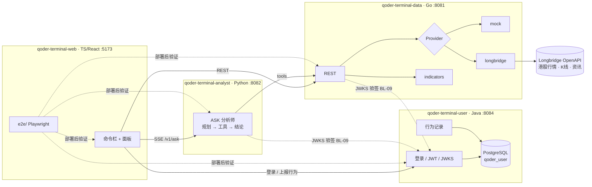

# 架构

## 契约归属

| 契约 | 维护方 | 消费方 |
|---|---|---|
| `qoder-terminal-data/api/openapi.yaml` | data | analyst、web |
| `qoder-terminal-analyst/api/openapi.yaml` + `agent-event.schema.json` | analyst | web |
| `qoder-terminal-user/api/openapi.yaml` + JWT claims | user | data、analyst、web |

**谁提供接口，谁维护契约。** 跨 repo 需求永远先合入提供方的契约变更，消费方再跟进；web 的 `e2e/tests/contracts.api.spec.ts` 在部署后校验契约是否被真实遵守。

## 设计原则

| 原则 | 落地 |
|---|---|
| 价格不用浮点 | 契约用十进制字符串；Go `internal/money` 定点数；前端只展示不运算 |
| 演示不翻车 | data 默认 `mock`，analyst 默认 `stub` LLM；真实行情一键切换 `DATA_PROVIDER=longbridge` |
| 统一交付入口 | 每个 repo `make lint / test`，服务都有 `GET /health` |
| 迁移与部署分离 | user 启动时不自动迁移；迁移只走 `make db-migrate`（AutoWonder QA 数据库步骤） |
| 让 QoderCLI 读得懂 | 每个 repo 有 `AGENTS.md` + `.qoder/rules/`，共享规则由 `scripts/sync-rules.sh` 下发 |

## 市场与标的

- 默认市场港股，标的格式 `700.HK`；命令栏可简写 `700`、`0700`。
- 演示标的：腾讯 `700.HK`、阿里 `9988.HK`、美团 `3690.HK`、小米 `1810.HK`、比亚迪 `1211.HK`、盈富基金 `2800.HK`。
- 交易时段（北京时间）09:30–12:00、13:00–16:00，午休不动，演示请避开。

## 已知环境坑

| 现象 | 原因 | 处理 |
|---|---|---|
| analyst 调 data 返回 502 | httpx 读取 macOS 系统代理，把 localhost 请求转发出去 | 服务间客户端 `trust_env=False` |
| data 连 Longbridge `i/o timeout`（198.18.x.x） | Clash fake-IP，Go 不读系统代理 | 设置 `HTTPS_PROXY=http://127.0.0.1:7897` |
| Longbridge `401003 token expired` | Legacy access token 过期 | 用户中心重新生成，或改用 OAuth（SDK 自动刷新） |
